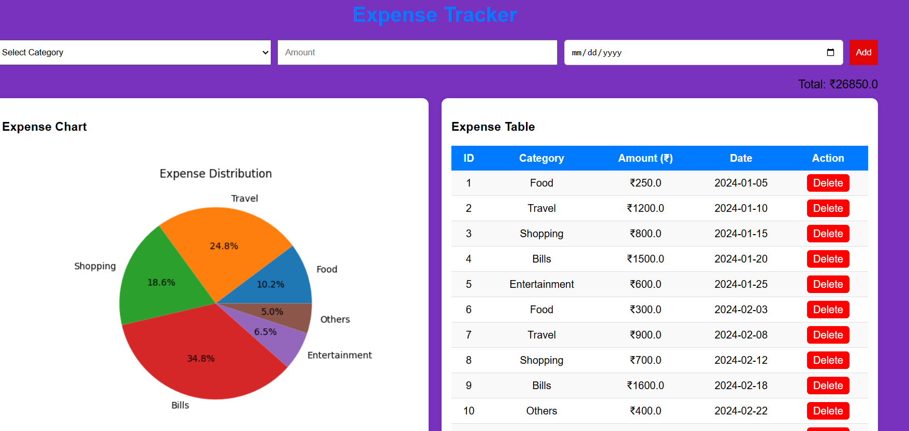


# Expense Tracker

A web-based expense tracker built using Flask and MySQL with data visualization.

## Features
- Add/Delete expenses
- Category-based tracking
- Date selection
- Monthly, yearly, daily graphs

## Tech Stack
- Python (Flask)
- MySQL
- Matplotlib

## How to Run
1. Install requirements
2. Run app.py
3. Open localhost:5000

## Screenshorts

##Dashboard

##Daily expenses
![Dashboard]

